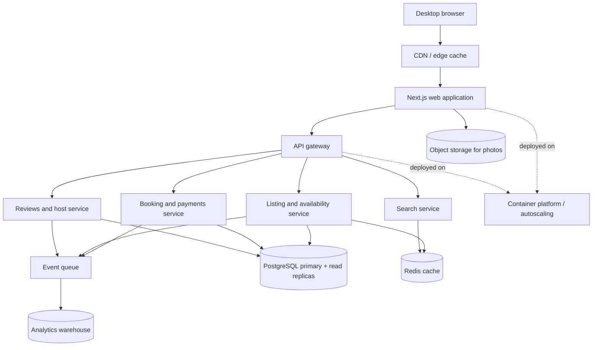

# Vacation Rental Marketplace Architecture

The web tier is stateless and horizontally scalable behind the CDN. Listing photos are served from object storage through immutable CDN URLs. Read-heavy listing and search traffic is absorbed by Redis and database read replicas, while booking writes remain transactional in the primary database. Domain events are published asynchronously for notifications, search indexing, and analytics.
